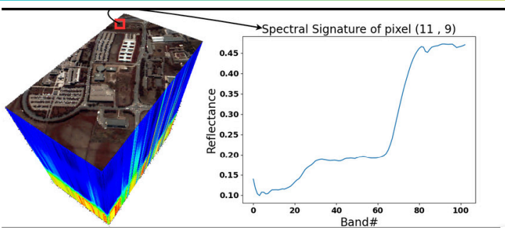
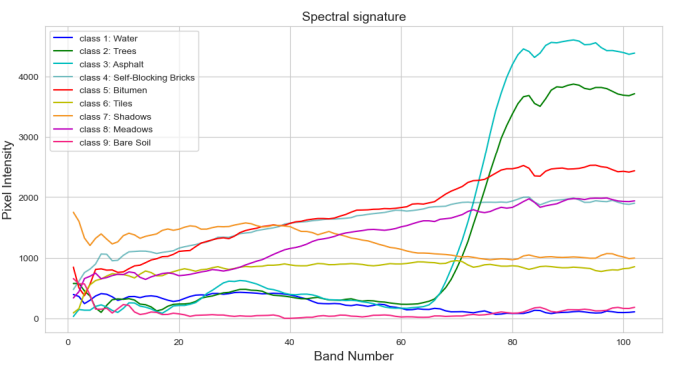
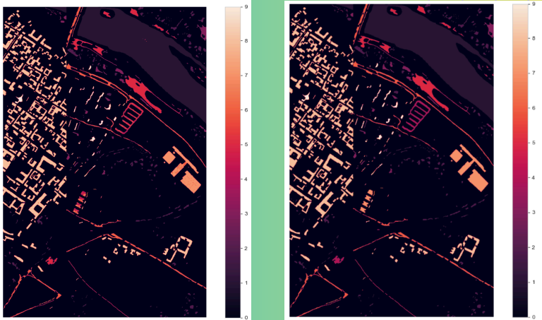

# Hyperspectral Image Processing Project

## Overview  
This project explores hyperspectral image processing using the Pavia Center dataset. The tasks include reconstructing realistic RGB images from hyperspectral data and applying a Convolutional Neural Network (CNN) to predict ground truth for classification.

## Hyperspectral Images  
Hyperspectral images capture detailed spectral information for each pixel across a wide range of wavelengths, including those beyond the visible spectrum. Each pixel holds reflectance values across different wavelengths, enabling precise analysis of the scene and its materials. This rich data can be used for various tasks like image reconstruction and classification.

## Dataset  
The **Pavia Center dataset** consists of two MATLAB files:
- `pavia.mat`: Contains the hyperspectral data cube, representing the spectral information for each pixel across multiple wavelength bands.
- `pavia_gt.mat`: Contains the corresponding ground truth labels used for classification.

#### Data cube

#### Spectral signatue

## Tasks Performed

1. **RGB Image Reconstruction**  
   Reconstructed an RGB image from the hyperspectral data by mapping selected spectral bands to the visible spectrum, creating a representation of the scene close to real-world colors.

2. **Ground Truth Prediction Using CNN**  
   Applied a CNN to the hyperspectral data to predict ground truth labels for classification, demonstrating the power of deep learning in hyperspectral image analysis.

### Prediction vs Ground Truth   

